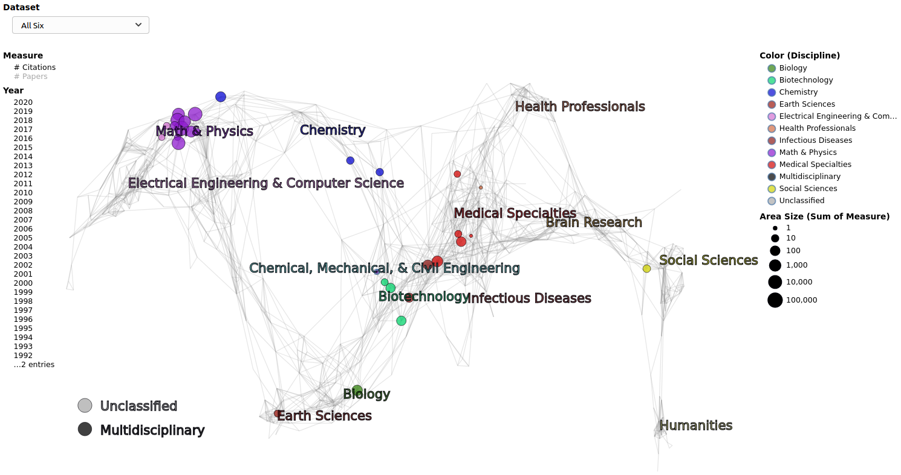

**Embracing data-driven decision making to manage and communicate the impact of big science projects**

<https://cns-iu.github.io/nature-expert-recommendation/>

This interactive data visualization accompanies the _Nature_ Expert Recommendation on “Embracing data-driven decision making to manage and communicate the impact of big science projects.” The visualization uses the UCSD Map of Science and Classification System computed using 2006–2008 data from Scopus and 2005–2010 data from the Web of Science ([1](https://journals.plos.org/plosone/article?id=10.1371/journal.pone.0039464)). The map organizes more than 25,000 journal/conference venues into 554 (sub)disciplines that are further aggregated into thirteen main scientific disciplines (e.g., physics, biology), which are labeled and color-coded in the map. The network of 554 (sub)disciplines is then laid out on the surface of a sphere and flattened using a Mercator projection. In order to create proportional symbol (here circle) overlays, a new dataset is “science-coded” using the journals (or keywords) associated with each of the 554 (sub)disciplines. For example, a paper published in the journal _Pharmacogenomics_ has the science-location ‘Molecular Medicine,’ as it is associated with this (sub)discipline in the discipline ‘Health Professionals’. The ‘Multidisciplinary’ node in lower left encodes journals such as _Science_ or _Nature_. The ‘Unclassified’ node next to it indicates how many papers could not be science located.

The map depicts the number of papers or citations (one measure must be selected or no data is shown) for six big science projects (select one or all datasets in top left menu) and their change over time (use Shift+Click to select any set of years on left). Circle color indicates scientific discipline while circle area side denotes the total number of papers or citations in a scientific subdiscipline, see legend in upper right. Hover over a node to see the number of papers/citations in that subdiscipline.

As time progresses, the number of papers and citations increase. The four physics and astronomy projects publish mainly in the ‘Math & Physics’ discipline. The biomedical projects publish in many different disciplines of science.

The table below shows the number of papers that have a publication venue that is indexed by Scopus and/or Web of Science and hence can be science located together with the number of subdisciplines that these papers are published in. We also list the number of papers in the ‘Multidisciplinary’ and ‘Unclassified’ category.

|Dataset|#Papers|#Citations|#Subdisciplines out of 554|#Papers in Multidisciplinary|#Papers in Unclassified|
|:--|--:|--:|--:|--:|--:|
|Physics > ATLAS          |13,729|177,233|21|2|9,999|
|Physics > BaBar          | 2,607| 50,687|8|0|1,550|
|Astronomy > LIGO         |   560| 41,287|12|4|150|
|Astronomy > IceCube      | 1,054| 23,155|12|6|655|
|Biomedical > HGP         |   106| 29,540|3|84|0|
|Biomedical > HCA & HuBMAP|    92|  2,856|17|14|36|
